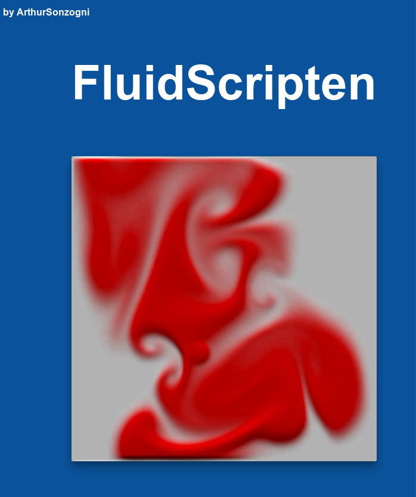

[](https://ArthurSonzogni.github.io/FluidScripten/)
========

C++ fluid simulation compiled in javascript with emscripten.

[ **Play Demo** ](https://ArthurSonzogni.github.io/FluidScripten/)


Building :
==========

This demo could be a starting point for learning how to setup **Emscripten** and **OpenGL* for you graphics applications. Fork it !

```{r, engine='bash', count_lines}
source ~/***/emsdk_set_env.sh
cd build
cmake -DCMAKE_CXX_COMPILER=em++ .. && make
firefox FluidScripten.html
```
